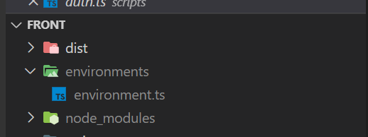

demo5以外は基本的に同じことをすれば動作します。

demo5はdemo5のREADMEを参照してください。

Azure AD App V2を用意しておく必要があります。

1. `webapi`ディレクトリのソリューションファイルの中にある`appsettings.json`を書き換え。

``` json
{
    ...
    "AzureAd": {
        "Instance": "https://login.microsoftonline.com/",
        "TenantId": "<Your Tenant ID>",
        "ClientId": "<Application ID>"
    }
}
```

2. VisualStudioやVisualStduioCodeでWebAPIをデバッグ実行

3. `front`ディレクトリに`environments/environments.ts`ファイルを作成



4. 作成したtsファイルの中身は下記の内容を記述

``` typescript
export const authEnv = {
  auth: {
    clientId: '<Azure AD Application ID>',
    authority: 'https://login.microsoftonline.com/<Tenant ID>'
  }
};
```

5. 下記コマンドを`front`ディレクトリで実行します(installは初回のみでOK)

```
npm install
npm run build
```

6. `front`ディレクトリで[LiveServer](https://marketplace.visualstudio.com/items?itemName=ritwickdey.LiveServer)などを使用し、`localhost:5500`にアクセスを行う

